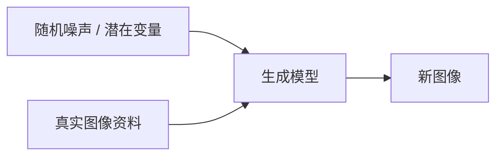
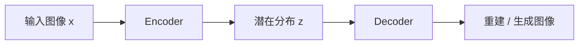
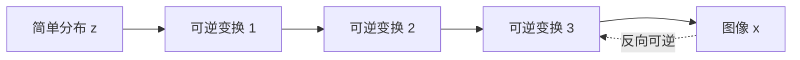
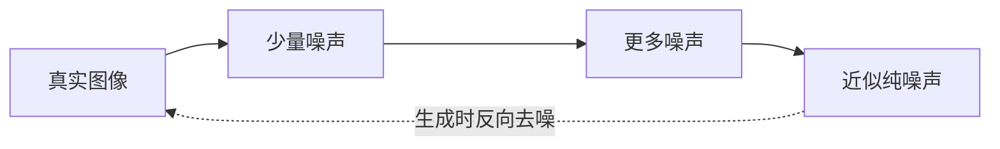
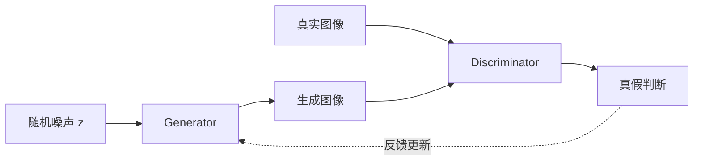

# 图像生成模型

- 图像有大量的隐藏信息
- 机器需要大量脑补

## 常用生成模型速览

影像生成模型的目标是学习真实图像背后的资料分布，然后从随机噪声或潜在变量中生成新的图像。常见方法可以从“如何把简单分布变成图像”这个角度理解。

### Variational Auto-encoder (VAE)

- VAE 可以看成“压缩再重建”的生成模型。Encoder 把输入图像压到潜在空间中的一个分布，Decoder 再从潜在变量还原图像。

### Flow-based Generative Model

- Flow-based model 用一连串可逆变换，把简单分布（例如 Gaussian）一步步变成复杂的图像分布。
- 因为每一步都可逆，所以既可以从噪声生成图像，也可以把图像精确映射回潜在空间。

### Diffusion Model

- Diffusion Model 的核心想法是：训练时逐步把真实图像加噪声，直到接近纯噪声；生成时再学习反向过程，把噪声一步步去掉。

### Generative Adversarial Network (GAN)

- GAN 由 Generator 和 Discriminator 两个网络组成。Generator 负责产生假图像，Discriminator 负责判断图像是真的还是假的。
- 训练过程像对抗：Generator 想骗过 Discriminator，Discriminator 想分辨真实图像与生成图像。两者互相推动，生成器逐渐学会产生更真实的图像。

